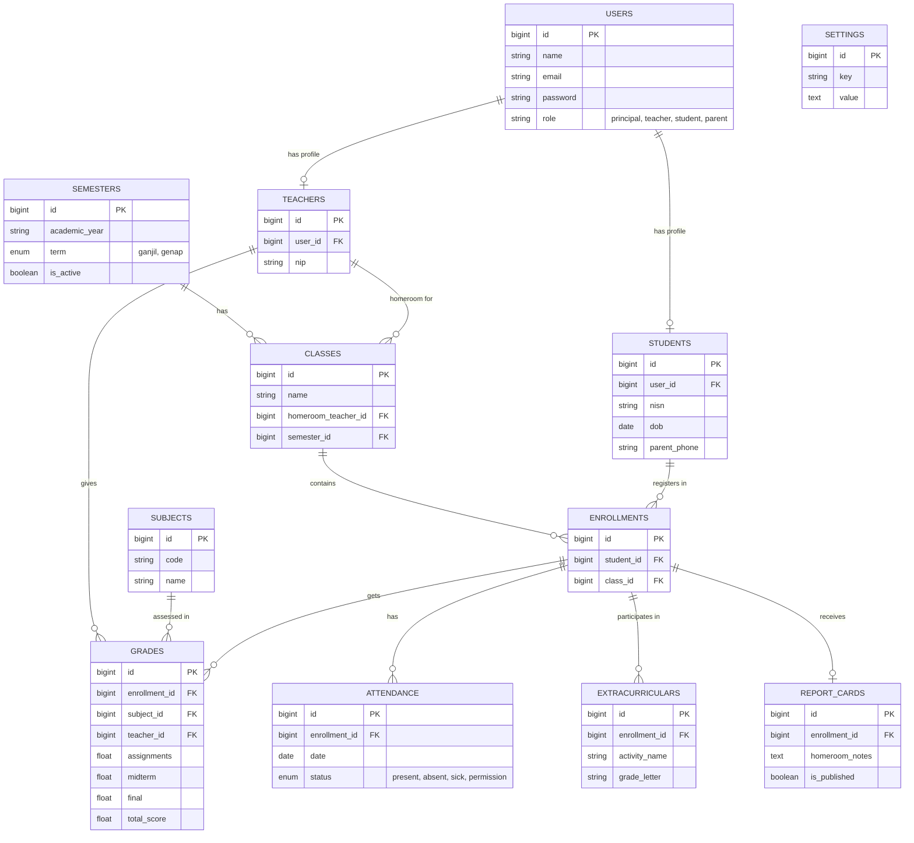

# Product Requirements Document (PRD)
## Sistem Manajemen Nilai Akademik (Academic Grading Management System)

### 1. Pendahuluan
**Sistem Manajemen Nilai Akademik** adalah platform terpusat berbasis web yang dirancang untuk mengelola data siswa, nilai, absensi, dan laporan raport secara digital. Sistem ini mempermudah institusi pendidikan dalam mewujudkan transparansi dan efisiensi administrasi akademik.

### 2. Tujuan Produk (Product Goals)
- Mewujudkan platform terpusat dan terpadu untuk semua aktivitas akademik sekolah.
- Mendigitalkan proses penilaian, absensi harian, dan rapor siswa.
- Memberikan akses transparansi nilai dan kehadiran secara real-time kepada siswa dan orang tua.
- Mempermudah guru dan wali kelas dalam menghitung nilai akhir serta mencetak rapor digital.

### 3. Target Pengguna (User Personas)
1. **Kepala Sekolah (Principal)**: Memantau rekapitulasi data sekolah secara keseluruhan, melihat statistik kelulusan, nilai rata-rata, dan kehadiran.
2. **Guru (Teacher)**: Memasukkan nilai per mata pelajaran, mengelola bobot penilaian, dan mencatat absensi harian.
3. **Wali Kelas (Homeroom Teacher)**: Memantau progres seluruh siswa dalam kelasnya, mengelola data absensi semester, mengisi catatan wali kelas, dan mengesahkan pencetakan rapor digital.
4. **Siswa (Student)**: Melihat nilai harian, absensi, jadwal ujian, dan rapor pribadi.
5. **Orang Tua (Parent)**: Memantau kehadiran anak secara harian, perkembangan nilai, dan melihat rapor.

### 4. Kebutuhan Fitur Utama (Core Features)
1. **Manajemen Data Siswa dan Guru**: CRUD data profil, riwayat akademik, dan manajemen akun pengguna.
2. **Input Nilai per Mata Pelajaran**: Fasilitas bagi guru untuk menginput nilai harian, UTS, UAS, dan tugas berdasarkan bobot yang ditentukan.
3. **Pencatatan Absensi Harian**: Modul untuk mencatat kehadiran, alpa, izin, dan sakit siswa setiap harinya.
4. **Pembagian Kelas dan Enrollment**: Sistem rotasi akademik untuk mendistribusikan siswa ke kelas yang tepat di setiap semesternya.
5. **Cetak Raport Digital**: Pembuatan laporan hasil belajar secara otomatis dalam bentuk PDF (termasuk nilai, absensi, dan ekskul).
6. **Rekap Absensi per Semester**: Dasbor khusus wali kelas untuk memverifikasi dan melihat akumulasi absen setiap siswanya.
7. **Data Ekstrakurikuler Siswa**: Pencatatan aktivitas non-akademik siswa beserta nilai/predikat yang diraih.

### 5. Arsitektur & Skema Data
#### 5.1 Penjelasan Naratif Arsitektur dan Data
Sistem dibangun menggunakan **Model-View-Controller (MVC)** dengan framework Laravel. Database menggunakan 12 tabel utama yang saling berelasi untuk mendukung seluruh fitur:

1. **`users`**: Tabel sentral untuk autentikasi dan otorisasi (menyimpan email, password, role).
2. **`students`**: Tabel profil detail siswa (NISN, tanggal lahir, alamat).
3. **`teachers`**: Tabel profil detail guru (NIP, spesialisasi).
4. **`subjects`**: Tabel daftar mata pelajaran beserta bobot SKS.
5. **`classes`**: Tabel rombongan belajar (misal: X-A, XI-IPA 1) yang dihubungkan dengan wali kelas.
6. **`semesters`**: Tabel master untuk tahun ajaran dan semester aktif.
7. **`enrollments`**: Tabel pivot yang mendaftarkan siswa ke kelas tertentu di suatu semester.
8. **`grades`**: Tabel transaksi nilai siswa per mata pelajaran (nilai tugas, UTS, UAS, dsb).
9. **`attendance`**: Tabel transaksional pencatatan kehadiran harian siswa.
10. **`report_cards`**: Tabel khusus untuk menyimpan snapshot/rekap rapor akhir siswa per semester beserta catatan wali kelas.
11. **`extracurriculars`**: Tabel pencatatan kegiatan di luar jam pelajaran dan nilai/predikat yang diraih siswa.
12. **`settings`**: Tabel konfigurasi sistem (nama sekolah, logo, rumus bobot nilai default, dll).

#### 5.2 Visualisasi ERD (Entity Relationship Diagram)

### 6. Kebutuhan Non-Fungsional (Non-Functional Requirements)
- **Privasi & Keamanan Data**: Data nilai dan rekam jejak siswa hanya boleh diakses oleh pihak terkait (siswa ybs, orang tua ybs, wali kelas, guru pengampu, dan kepsek).
- **Integritas Database**: Menggunakan constraint dan *foreign key* yang kuat di 12 tabel agar mencegah kehilangan/inkonsistensi data ketika ada penghapusan.
- **Performa & Ekspor Dokumen**: Proses *generate* rapor PDF secara dinamis dan massal harus ditangani secara asinkron (menggunakan background jobs) agar server tidak memblokir antarmuka pengguna.
- **User Interface**: Desain yang intuitif dan ramah digunakan dari perangkat mobile (Mobile Responsive) bagi orang tua dan siswa.
